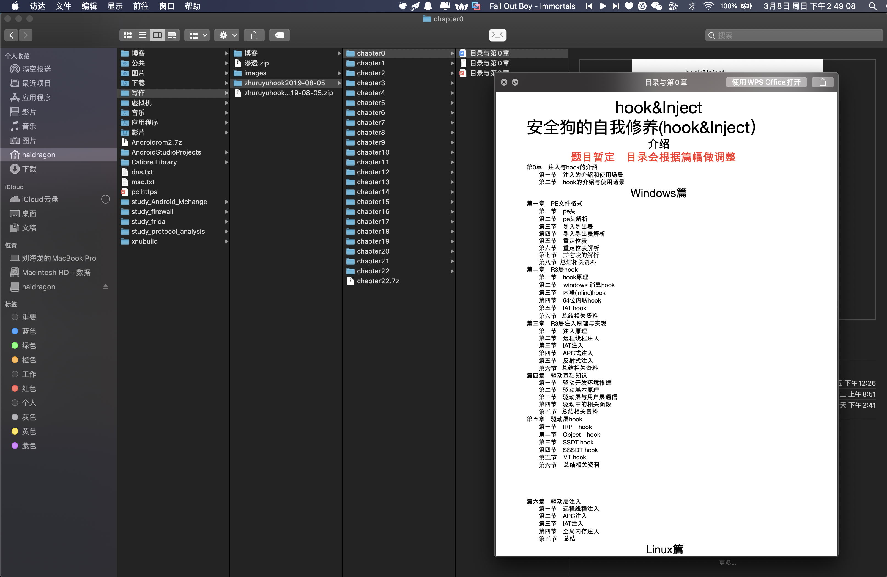
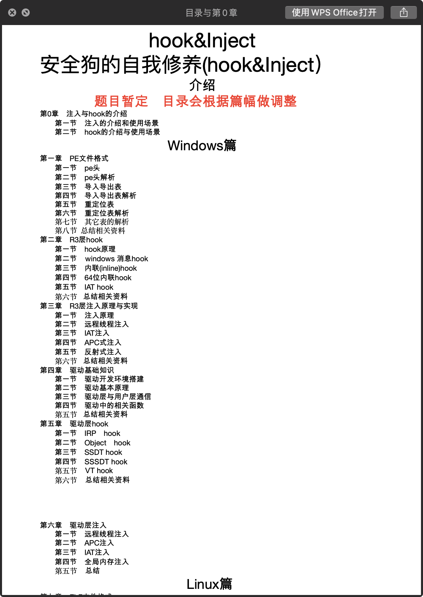
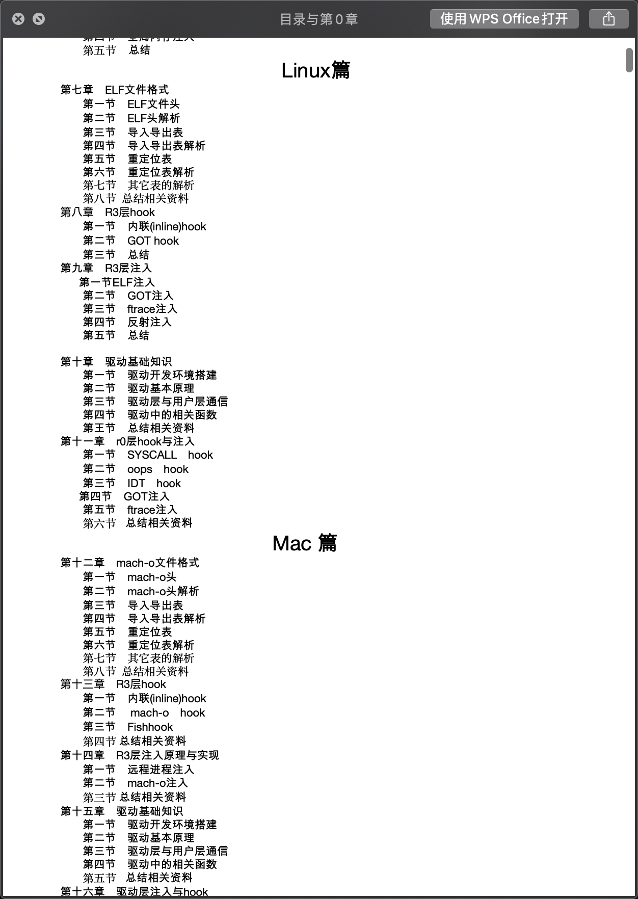
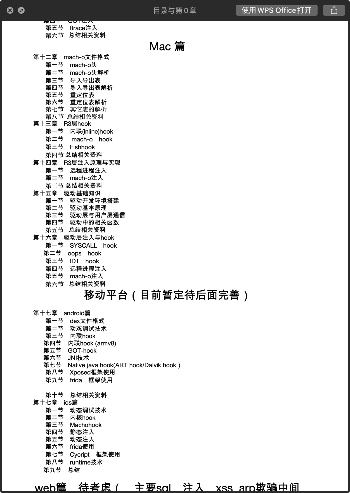

# study_injection_and_hook
注入与hook

# 视频持续更新.......  
* 已上传 b站 地址：https://space.bilibili.com/411849899
# 其它教程
* study_frida https://github.com/haidragon/study_frida
* study_exploits https://github.com/haidragon/study_exploits
* study_executable_file_formats https://github.com/haidragon/study_executable_file_formats
* study_computer_forensics https://github.com/haidragon/study_computer_forensics
* study_anti_rootkit https://github.com/haidragon/study_anti_rootkit
* study_file_filter https://github.com/haidragon/study_file_filter
* study_reverse_analysis https://github.com/haidragon/study_reverse_analysis
* study_tools https://github.com/haidragon/study_tools
* study_exceptions_and_debugging https://github.com/haidragon/study_exceptions_and_debugging
* study_Xposed https://github.com/haidragon/study_Xposed
* study_firewall https://github.com/haidragon/study_firewall
* study_obscure https://github.com/haidragon/study_obscure
* study_Android_Mchange https://github.com/haidragon/study_Android_Mchange
* study_protocol_analysis https://github.com/haidragon/study_protocol_analysis
 
* 有的课题可能没第一时在这写，可以关注我微博 [haidragonx](https://weibo.com/haidragon)同时我也会出其它教程，比如 主动防御(window驱动/linux驱动/mac驱动）、android/ios逆向、流量分析等等 有任何问题。可以联系作者
* qq/wechat：2207344074
 

